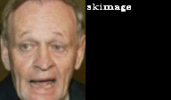

# Preprocessing Scripts

## Face alignment

This repo is an example how to align facial images once the 5 facial landmark is detected.

- Left eye
- Right eye
- Nose
- Left mouth
- Right mouth

I use MTCNN to obtain these landmarks. MTCNN can be installed:
```
pip install mtcnn
```

The canonical position of the landmarks are hard coded.
```
canonical_positions = np.array([
    [30.2946, 51.6963],
    [65.5318, 51.5014],
    [48.0252, 71.7366],
    [33.5493, 92.3655],
    [62.7299, 92.2041]], dtype=np.float32)
```

Three different alignment method was used to estimate the affine transformations:
- skimage.transform.SimilarityTransform().estimate()
- cv2.estimateAffine2D()
- cv2.estimateAffinePartial2D(l)


##### Examples:





